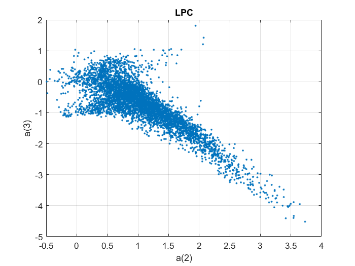
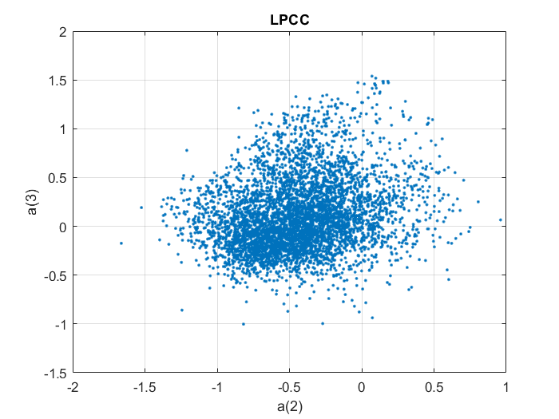
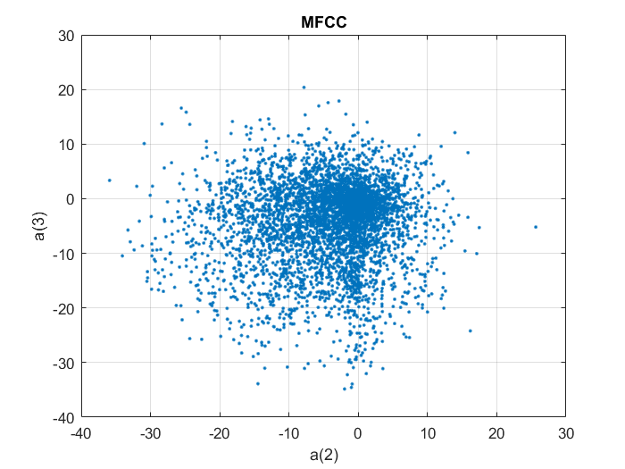
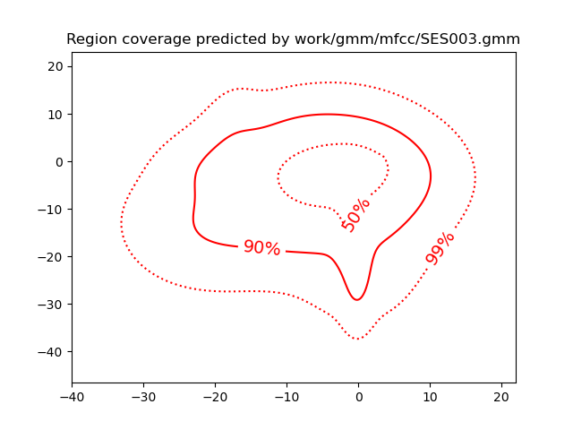
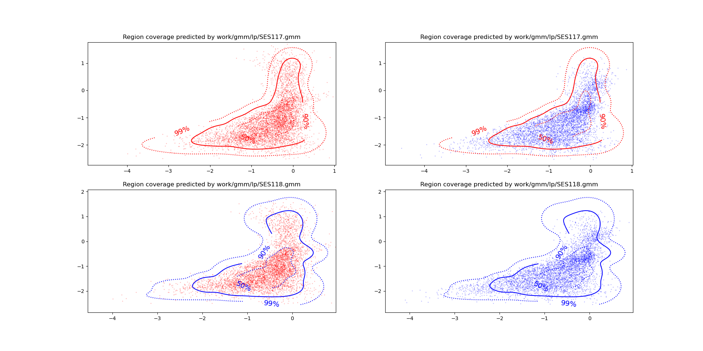

PAV - P4: reconocimiento y verificación del locutor
===================================================

Obtenga su copia del repositorio de la práctica accediendo a [Práctica 4](https://github.com/albino-pav/P4)
y pulsando sobre el botón `Fork` situado en la esquina superior derecha. A continuación, siga las
instrucciones de la [Práctica 2](https://github.com/albino-pav/P2) para crear una rama con el apellido de
los integrantes del grupo de prácticas, dar de alta al resto de integrantes como colaboradores del proyecto
y crear la copias locales del repositorio.

También debe descomprimir, en el directorio `PAV/P4`, el fichero [db_8mu.tgz](https://atenea.upc.edu/mod/resource/view.php?id=3654387?forcedownload=1)
con la base de datos oral que se utilizará en la parte experimental de la práctica.

Como entrega deberá realizar un *pull request* con el contenido de su copia del repositorio. Recuerde
que los ficheros entregados deberán estar en condiciones de ser ejecutados con sólo ejecutar:

~~~~~~~~~~~~~~~~~~~~~~~~~~~~~~~~~~~~~~~~~~~~~~~~~~~~~.sh
  make release
  run_spkid mfcc train test classerr verify verifyerr
~~~~~~~~~~~~~~~~~~~~~~~~~~~~~~~~~~~~~~~~~~~~~~~~~~~~~

Recuerde que, además de los trabajos indicados en esta parte básica, también deberá realizar un proyecto
de ampliación, del cual deberá subir una memoria explicativa a Atenea y los ficheros correspondientes al
repositorio de la práctica.

A modo de memoria de la parte básica, complete, en este mismo documento y usando el formato *markdown*, los
ejercicios indicados.

## Ejercicios.

### SPTK, Sox y los scripts de extracción de características.

- Analice el script `wav2lp.sh` y explique la misión de los distintos comandos involucrados en el *pipeline*
  principal (`sox`, `$X2X`, `$FRAME`, `$WINDOW` y `$LPC`). Explique el significado de cada una de las 
  opciones empleadas y de sus valores.

  ```bash 
  sox $inputfile -t raw -e signed -b 16 - | $X2X +sf | $FRAME -l 240 -p 80 | $WINDOW -l 240 -L 240 | $LPC -l 240 -m $lpc_order > $base.lp || exit 1
  ```

    >### sox: 
    >Convierte la señal de entrada a reales en coma flotante de 16 bits sin cabecera (raw), y escribe el resultado en la salida estándar. 
    >- -t: Tipo de fichero de audio (raw).
    >- -e: Tipo de codificación (signed).
    >- -b: Tamaño de la muestra codificada, en bits. (16)

    >### $X2X: 
    >Programa de SPTK que permite la conversión entre distintos formatos de datos. Hacemos esta operación en dos pasos porque x2x no permite leer ficheros en formato WAVE (o cualquier otro, solo permite RAW). En este caso +sf indica s (short, 2byte) y  f (float, 4byte).

    >### $FRAME: 
    >Divide la señal de entrada en tramas de 240 muestras (30 ms) con desplazamiento de ventana de 80 muestras (10 ms). Tener en cuenta que la frecuencia de muestreo es de 8 kHz.
    >- -l: frame length (240).
    >- -p: frame period (80).

    >### $WINDOW: 
    >Multiplica cada trama por la ventana de Blackman (opción por defecto).
    >- -l: frame length of input (240).
    >- -L: frame length of output (240).

    >### $LPC: 
    >Calcula los lpc_order primeros coeficientes de predicción lineal, precedidos por el factor de ganancia del predictor.
    >- -l: frame length (240)
    >- -m: order of LPC ($lpc_order)

    >Vemos como finalmente el resultado del pipeline se redirecciona a un fichero temporal $base.lp, cuyo nombre es el mismo que el del script seguido del identificador del proceso (de este modo se consigue un fichero temporal único para cada ejecución).

- Explique el procedimiento seguido para obtener un fichero de formato *fmatrix* a partir de los ficheros de
  salida de SPTK (líneas 45 a 51 del script `wav2lp.sh`).
  ```bash 
    # Main command for feature extration
    sox $inputfile -t raw -e signed -b 16 - | $X2X +sf | $FRAME -l 240 -p 80 | $WINDOW -l 240 -L 240 |
    $LPC -l 240 -m $lpc_order > $base.lp || exit 1
   

    # Our array files need a header with the number of cols and rows:
    ncol=$((lpc_order+1)) # lpc p =>  (gain a1 a2 ... ap) 
    nrow=`$X2X +fa < $base.lp | wc -l | perl -ne 'print $_/'$ncol', "\n";'`

    # Build fmatrix file by placing nrow and ncol in front, and the data after them
    echo $nrow $ncol | $X2X +aI > $outputfile
    cat $base.lp >> $outputfile 
  ```

  >Una vez almacenado el resultado de la parametrización en un fichero temporal ($base.lp), hemos de almacenar la información en un fichero fmatrix. 
  >- Numero de columnas = orden del predictor + 1. Hace falta añadir 1 ya que en el primer elemento del vector se almacena la ganancia de predicción -> (gain a1 a2 ... ap)
  >- Numero de filas. Las extraemos del fichero obtenido. Lo hacemos convirtiendo la señal parametrizada a texto usando sox +fa, y contando el número de líneas, con el comando UNIX wc -l.
  Esta obtención del número de filas depende de la logintud de la señal, la longitud y desplazamiento de la ventana, y la cadena de comandos que se ejecutan para obtener la parametrización.

  * ¿Por qué es más conveniente el formato *fmatrix* que el SPTK?

    > Utilizando este formato se puede pasar de una señal de entrada que es un señal unidimensional (un vector) con las muestras de la señal de audio a una matriz en la que se tiene un fácil y rápido acceso a todos los datos almacenados. 
    Además, tienen una correspondencia directa entre la posición en la matriz y el orden del coeficiente y número de trama, por lo que simplifica mucho su manipulación a la hora de trabajar. También ofrece información directa en la cabecera sobre el número de tramas y de coeficientes calculados

- Escriba el *pipeline* principal usado para calcular los coeficientes cepstrales de predicción lineal
  (LPCC) en su fichero <code>scripts/wav2lpcc.sh</code>:
  >Este es el pipeline principal:
  ```bash 
  sox $inputfile -t raw -e signed -b 16 - | $X2X +sf | $FRAME -l 240 -p 80 | $WINDOW -l 240 -L 240 |
	$LPC -l 240 -m $lpc_order | $LPCC -m $lpc_order -M $cepstrum_order> $base.lpcc || exit 1
  ```

- Escriba el *pipeline* principal usado para calcular los coeficientes cepstrales en escala Mel (MFCC) en su
  fichero <code>scripts/wav2mfcc.sh</code>:
  >Este es el pipeline principal:
  ```bash 
  sox $inputfile -t raw -e signed -b 16 - | $X2X +sf | $FRAME -l 240 -p 80 | $WINDOW -l 240 -L 240 |
	$MFCC -l 240 -m $mfcc_order -n $filter_bank_order -s $freq > $base.mfcc|| exit 1
  ```

### Extracción de características.

- Inserte una imagen mostrando la dependencia entre los coeficientes 2 y 3 de las tres parametrizaciones
  para todas las señales de un locutor.

  
  
  
  
  + Indique **todas** las órdenes necesarias para obtener las gráficas a partir de las señales 
    parametrizadas.
    >Primero ha sido necesario dar permiso de ejecución a los dos archivos creados para lpcc (/home/joan/PAV/bin/wav2lpcc) y mfcc (/home/joan/PAV/bin/wav2mfcc). Lo hemos hecho mediante las ordenes: 
    ```bash 
    chmod +x /home/joan/PAV/bin/wav2lpcc #Para lpcc
    chmod +x /home/joan/PAV/bin/wax2mfcc #Para mfcc
    ```
    >Después hemos ejecutamos el script run_spkid para cada predicción. Éste nos calcula todas las predicciones de cada interlocutor y frase y los guarda en la carpeta 'work/(prediccion)/(Bloque)/(Interlocutor)/(frase)':
    ```bash 
    FEAT=lp /home/joan/PAV/bin/run_spkid lp     #Para lpc
    FEAT=lpcc /home/joan/PAV/bin/run_spkid lpcc #Para lpcc
    FEAT=mfcc /home/joan/PAV/bin/run_spkid mfcc #Para mfcc
    ```
    >Luego guardamos en un archivo (prediccion).txt situado en la carpeta grafics/ los coeficientes correspondientes a a(2) y a(3) para después hacer las gràficas. En nuestro caso lo hacemos con el interlocutor SES013.
    ```bash 
    fmatrix_show work/lp/BLOCK01/SES013/*.lp | egrep '^\[' | cut -f4,5 > grafics/lp.txt    #Para lpc
    fmatrix_show work/lpcc/BLOCK01/SES013/*.lpcc | egrep '^\[' | cut -f4,5 > grafics/lpcc.txt #Para lpcc
    fmatrix_show work/mfcc/BLOCK01/SES013/*.mfcc | egrep '^\[' | cut -f4,5 > grafics/mfcc.txt #Para mfcc
    ```
    >Finalmente, usamos Matlab para representar las gràficas de cada una de las predicciones cambiando el archivo .txt de entrada:
    ```matlab 
    I = importdata('lpcc.txt');
    figure
    plot(I(:,1),I(:,2),'.')
    grid on
    xlabel('a(2)')
    ylabel('a(3)')
    title('LPCC')
    ```
    >Mediante Python lo podemos hacer de la siguiente manera:
    ```python 
    import numpy as np
    import matplotlib.pyplot as plt

    # Cargar los datos desde el archivo de texto
    data = np.loadtxt('lp.txt')

    # Separar los datos en dos arrays
    x = data[:, 0]
    y = data[:, 1]

    # Hacer el gráfico
    plt.scatter(x, y, s=4, marker='o')
    plt.xlabel('X Label')
    plt.ylabel('Y Label')
    plt.title('LP')
    plt.show()
    ```


  + ¿Cuál de ellas le parece que contiene más información?
    >La gráfica que parece que contiene más información es la del MFCC seguida del LPCC ya que se notan mucho más incorreladas que en la LPC. Esto aporta una mayor entropia y por tanto más información. 
    En cambio en la gráfica del LP vemos como están muy correlados y juntos y por tanto nos nos aporta demasiada información (No hay mucha dispersión).

- Usando el programa <code>pearson</code>, obtenga los coeficientes de correlación normalizada entre los
  parámetros 2 y 3 para un locutor, y rellene la tabla siguiente con los valores obtenidos.

  ```bash 
  pearson work/lp/BLOCK01/SES013/*.lp
  pearson work/lpcc/BLOCK01/SES013/*.lpcc
  pearson work/mfcc/BLOCK01/SES013/*.mfcc
  ```

  |                        | LP   | LPCC | MFCC |
  |------------------------|:----:|:----:|:----:|
  | &rho;<sub>x</sub>[2,3] | -0,812152     | 0,223452 | 0,0771908   |
  
  + Compare los resultados de <code>pearson</code> con los obtenidos gráficamente.
  >Los resultados concuerdan con las gráficas y con la explicación anterior ya que comprobamos que de mayor a menor correlación siguen el orden: LPC, LPCC, MFCC. Por tanto la MFCC es la menos correlada, más dispersa.  
- Según la teoría, ¿qué parámetros considera adecuados para el cálculo de los coeficientes LPCC y MFCC?
>LPCC: de 8 a 12 coeficientes de predicción (P) y (3/2)P coeficientes cepstrales (Q).
>MFCC: Se usan entre 14 y 18 coeficientes para reconocimiento del hablante. Se suele usar un banco de 24 a 40 filtros paso-banda en la escala Mel, aunque también se obtienen buenos resultados con 20.

### Entrenamiento y visualización de los GMM.

Complete el código necesario para entrenar modelos GMM.

- Inserte una gráfica que muestre la función de densidad de probabilidad modelada por el GMM de un locutor
  para sus dos primeros coeficientes de MFCC.
  

- Inserte una gráfica que permita comparar los modelos y poblaciones de dos locutores distintos (la gŕafica
  de la página 20 del enunciado puede servirle de referencia del resultado deseado). Analice la capacidad
  del modelado GMM para diferenciar las señales de uno y otro.
  


### Reconocimiento del locutor.

Complete el código necesario para realizar reconociminto del locutor y optimice sus parámetros.

- Inserte una tabla con la tasa de error obtenida en el reconocimiento de los locutores de la base de datos
  SPEECON usando su mejor sistema de reconocimiento para los parámetros LP, LPCC y MFCC.
  
  |    Parametros          | LP    | LPCC  |  MFCC |
  |------------------------|:-----:|:-----:|:-----:|
  | FEAT order             |   10   |   30  |   18   |
  | Cepstrum order         |   -   |   29  |   -   |
  | Filter bank            |   -   |   -   |   26   |
  | Frequency              |   -   |   -   |   16   |
  | Nº of Mixtures         |   29   |   27  |   30   |
  | Max Iterations         |   31   |   20  |   30   |
  | Inicialization         |   EM   |   VQ  |   VQ   |
  | Tasa de error          |  8.15% | 0.13% |  1.02% |

### Verificación del locutor.

Complete el código necesario para realizar verificación del locutor y optimice sus parámetros.

- Inserte una tabla con el *score* obtenido con su mejor sistema de verificación del locutor en la tarea
  de verificación de SPEECON. La tabla debe incluir el umbral óptimo, el número de falsas alarmas y de
  pérdidas, y el score obtenido usando la parametrización que mejor resultado le hubiera dado en la tarea
  de reconocimiento.

  |    Parametros          | LP    | LPCC  |  MFCC |
  |------------------------|:-----:|:-----:|:-----:|
  |Tasa de error (Classify)|  8.15% | 0.13% |  1.02% |
  | Nº of Mixtures (World) |   35   |   29  |   30   |
  | Max Iterations (World) |   35  |   30  |   30   |
  | Inicialization (World) |   VQ  |   VQ  |   VQ   |
  | Misses                 |   81   |   4   |   23   |
  | False Alarms           |   9   |   3   |   4   |
  | Optimum Threshold      |0.349309232522008|0.162269156593922|0.622179747163205|
  | CostDetection          |   40.5   |   4.3   |   12.8   |
  
 
### Test final

- Adjunte, en el repositorio de la práctica, los ficheros `class_test.log` y `verif_test.log` 
  correspondientes a la evaluación *ciega* final.


### Trabajo de ampliación.

- Recuerde enviar a Atenea un fichero en formato zip o tgz con la memoria (en formato PDF) con el trabajo 
  realizado como ampliación, así como los ficheros `class_ampl.log` y/o `verif_ampl.log`, obtenidos como 
  resultado del mismo.
